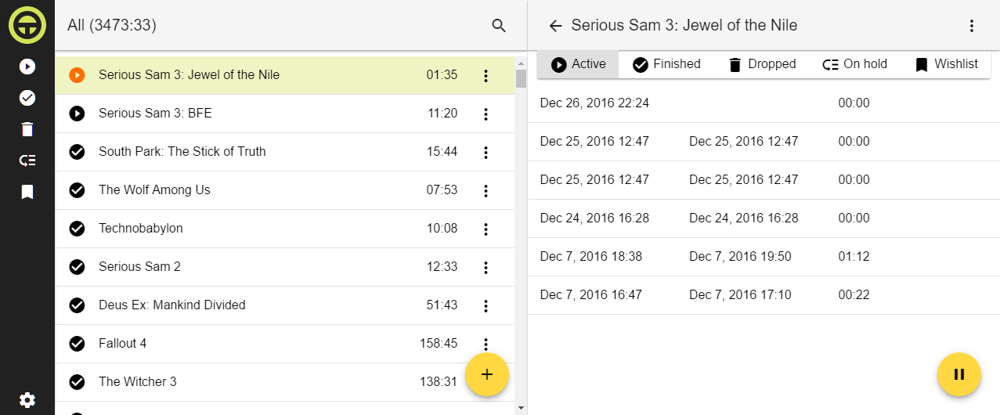

<div align="center"></div>
#Timer 2
Angular 2 version of Timer.

#About
Timer measures how much time you've spent playing video games (or really doing anything else) session by session. Games can also be managed by assigning one of the statuses: finished, on hold, dropped or in wishlist. Due to the fact that session start/stop happens by user input only instead of fancy application execution tracking, Timer does not impose any platform requirements.

<a href="https://raw.githubusercontent.com/Klaster1/timer2/master/screenshot.png"></a>

It also doubles as a sort of TodoMVC and playground for me.

#Development
Install dependencies:
```sh
npm install
npm run jspm install
npm run gulp sass
npm run bundle:vendor
```
Run dev tools separately:
```sh
npm run gulp watch-styles
```
```sh
npm run lite-server
```
```sh
npm run bundle:dev
```

#Releasing
*TBD*
